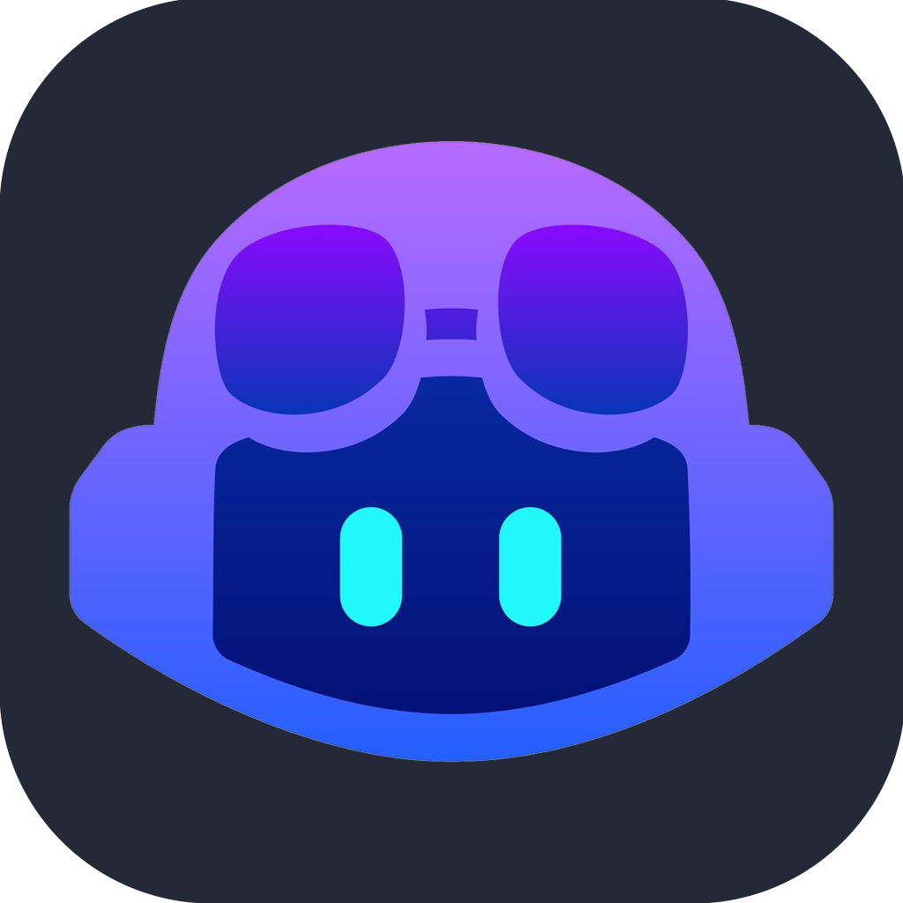

# Hi, I'm Gustavo 👋

### Frontend Developer & Information Systems Student

I am a Frontend Developer with a strong focus on building modern, performant web applications. Using **React**, **Next.js**, and **Tailwind CSS**, I create scalable and intuitive user interfaces. 

My development approach emphasizes solid UI/UX principles, component-driven design, and maintainable code architecture. Alongside my frontend work, I am actively expanding my backend capabilities to build complete, end-to-end solutions.

---

### 💼 Experience & Education
* **Frontend Developer Intern** – Remote (US-based Startup)
* **BSc in Information Systems** (In Progress) – UniFOA, Brazil

### 💻 Frontend Architecture

### ⚙️ Backend Fundamentals

### 🌐 Deployment, Cloud & VPS

### 🛠️ Core Tools & Technologies

### 🤖 AI-Assisted Development
 

### 🗣️ Languages
&nbsp;
&nbsp;

---

### 🚀 Current Focus & Professional Goal

* **Current Focus:** Mastering the end-to-end software development lifecycle. While refining my frontend architecture skills, I am diving deep into backend ecosystems, database management, and cloud infrastructure (including VPS provisioning and CI/CD pipelines) to ensure I can independently build, ship, and maintain robust applications.
* **Long-Term Goal:** Evolving into a highly proficient Full Stack Developer recognized for making sound architectural decisions. I aim to master industry best practices to engineer scalable, secure, and high-performance web applications that solve real-world problems.

## 📫 **Feel free to check my repositories and follow my progress.**
